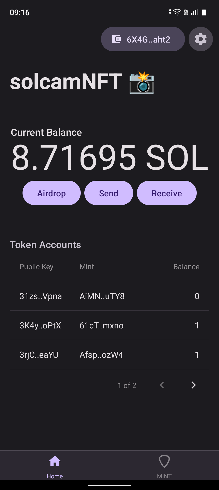
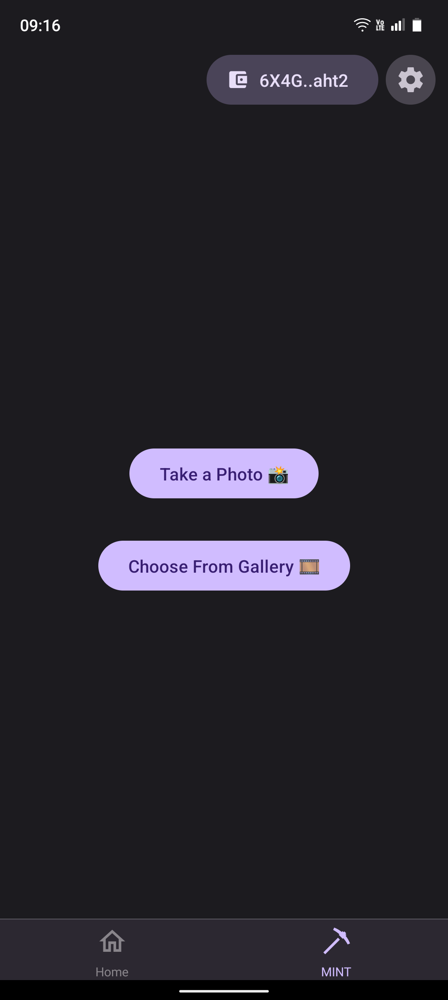
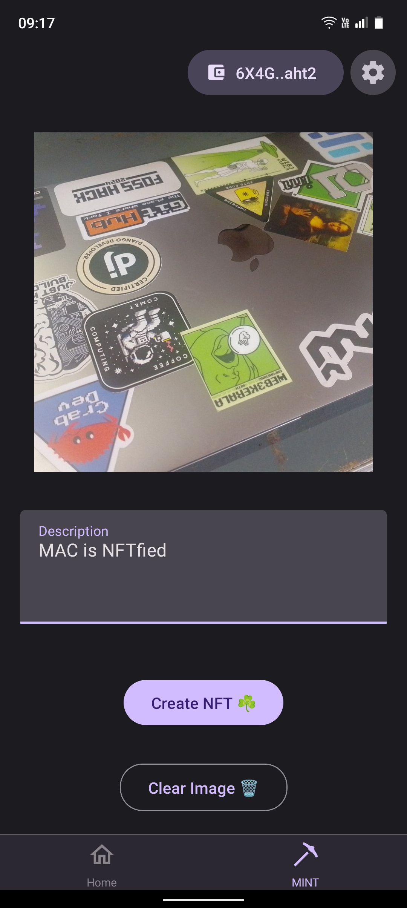

# solcamNFT

Mobile app that captures an image through the camera, mints an NFT with that image, and adds the current location longitude, latitude in the metadata.

<table>
  <tr>
    <td align="center">
      
    </td>
    <td align="center">
      
    </td>
    <td align="center">
      
    </td>
  </tr>
</table>

## Tech Stack

| Library               | Category          | Version | Description                                           |
| --------------------- | ----------------- | ------- | ----------------------------------------------------- |
| React Native          | Mobile Framework  | v0.73   | The best cross-platform mobile framework              |
| Expo                  | SDK               | v50     | Allows (optional) Expo modules                        |
| React                 | UI Framework      | v18     | The most popular UI framework in the world            |
| Mobile Wallet Adapter | SDK               | v2.0    | Connect and request signing from mobile wallet apps   |
| Solana web3.js        | SDK               | v1.78   | General Solana library for transactions and RPCs      |
| spl-token             | SDK               | v0.41   | Library for building with Solana SPL tokens           |
| React Native Paper    | Component Library | v18     | Production-ready components following Material Design |
| React Navigation      | Navigation        | v6      | Performant and consistent navigation framework        |
| React Query           | State management  | v5.24   | Async query management                                |
| TypeScript            | Language          | v5      | Static typechecking                                   |
| AsyncStorage          | Persistence       | v1      | State persistence                                     |

## Quick Start

### Prerequisites

- A free [Expo](https://expo.dev/) account.
- An Android device/emulator to test your app
  - Install an MWA compliant wallet app on your device/emulator.
- If using Expo's cloud service `eas build`, no further setup is required.
- If building locally:
  - React Native and Android Envrionment [setup](https://docs.solanamobile.com/getting-started/development-setup)

### Setting Up Locally

Clone the repository

```
git clone https://github.com/4rjunc/solcamNFT.git
```
